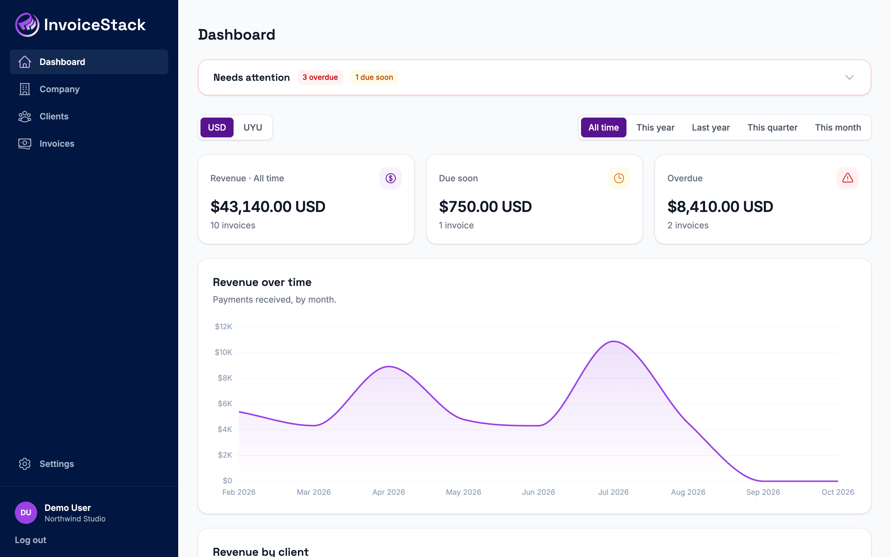
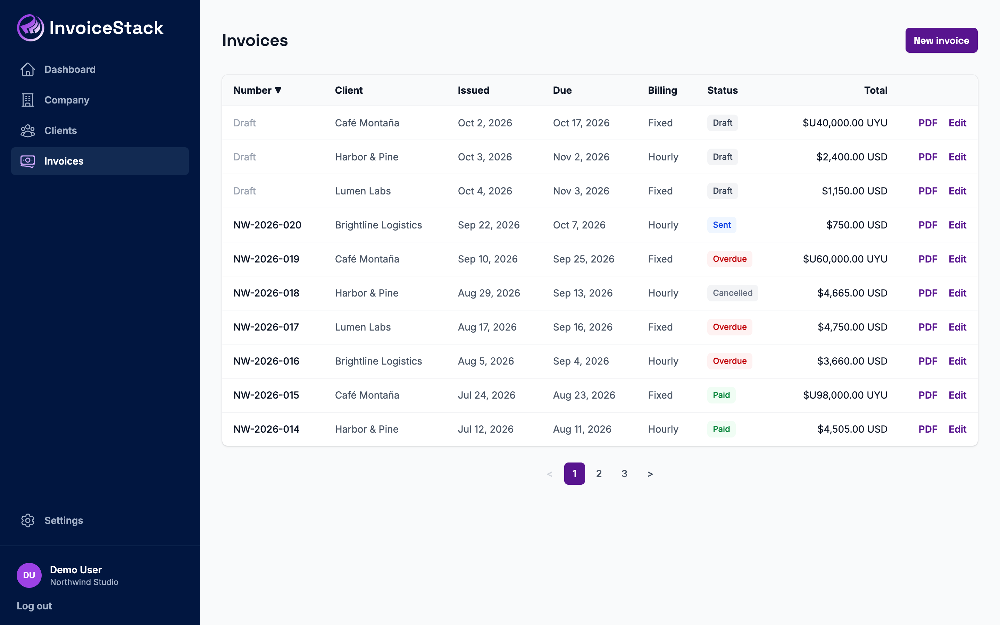
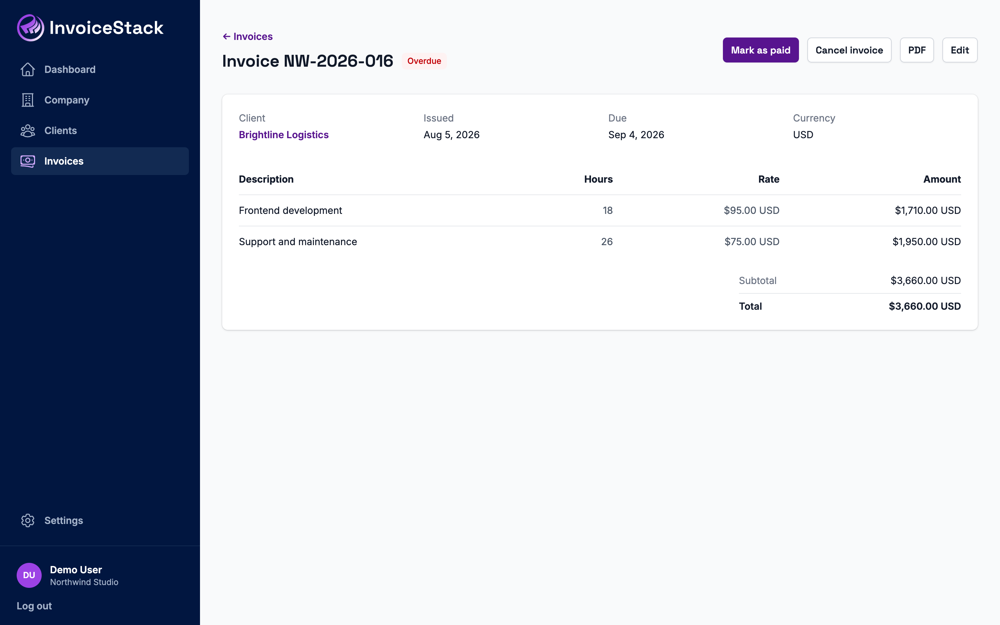
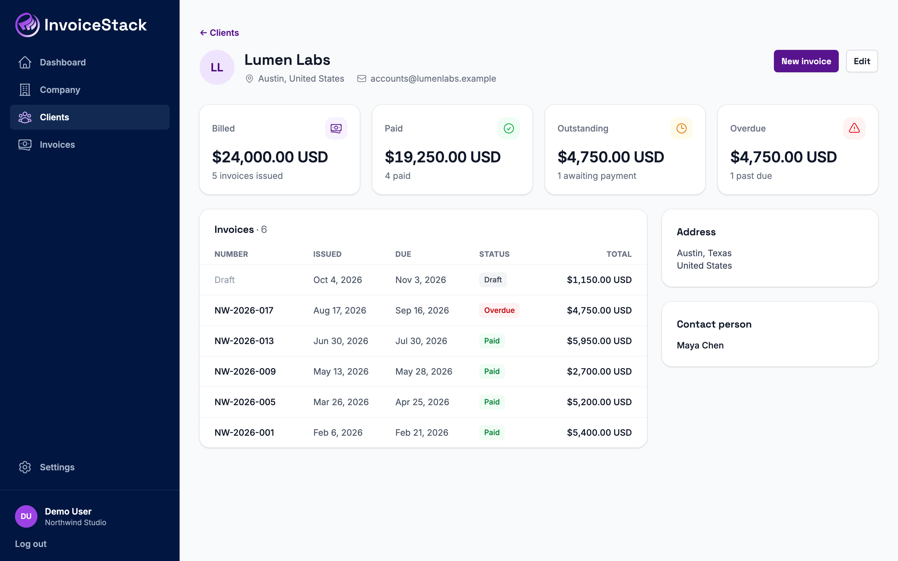
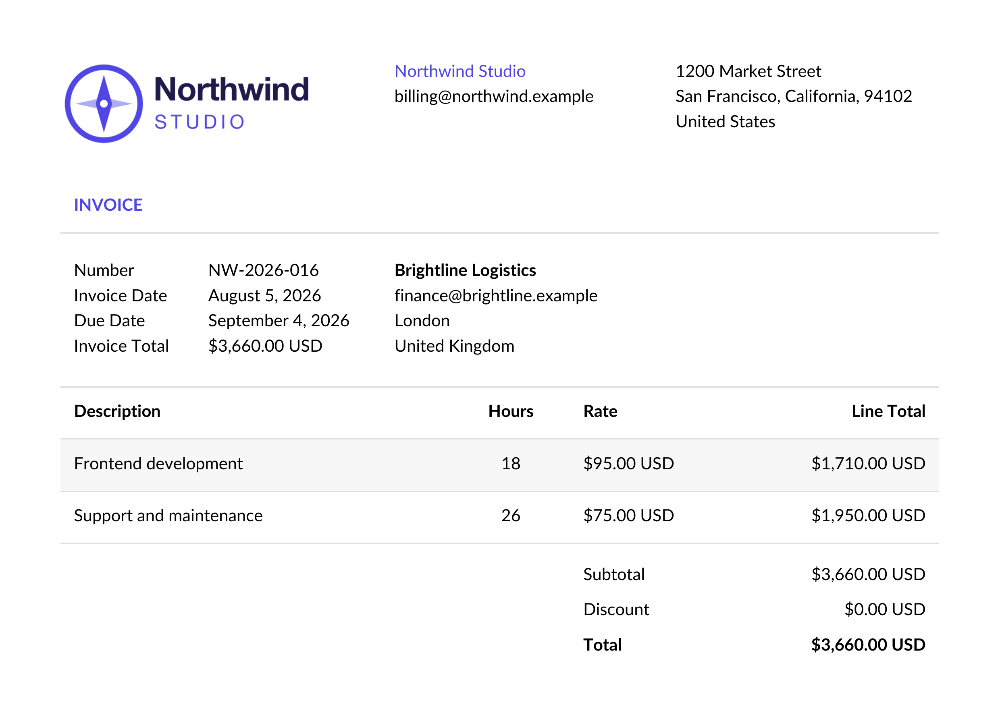

# InvoiceStack

Invoicing for freelancers and small studios: clients, fixed-price and hourly invoices, PDF export and gap-free invoice numbering, with each company's data kept separate.

Built with Ruby on Rails 8.1, PostgreSQL, Hotwire and Tailwind CSS.



| Invoices | Invoice |
| --- | --- |
|  |  |
| **Client** | **PDF** |
|  |  |

## Features

- **Invoices** billed at a fixed price or by the hour, in any currency, with a discount and notes. They move from draft to sent to paid, or are cancelled.
- **PDF export** with the company's logo, address and accent color.
- **Invoice numbers** built from a pattern such as `INV-{YEAR}-{NUMBER}`, assigned when an invoice is sent.
- **Clients** with contact details, and what each one has been billed, has paid and still owes.
- **Dashboard** with revenue, invoices due soon and overdue, and revenue charts, filtered by period and currency.
- **Company settings** for the time zone, default currency, invoice numbering and default invoice notes.

## Design decisions

- **Each company's data stays separate.** Every query goes through the signed-in user's company, and tests check that one company can't read or change another's records. The database enforces it too: an invoice's client is a composite foreign key on `(company_id, client_id)`, so an invoice can't point at another company's client.
- **Invoice numbers have no gaps.** A draft gets its number only when it's sent. The next number is reserved under a row lock in the same transaction that saves the invoice, so concurrent requests can't take the same number, and a unique index backs this up. Sent invoices can be cancelled but not deleted, so no number is ever lost or reused.
- **Money is exact.** Amounts are stored as decimals, and each line is rounded before it's added up, with the same rule in Ruby and in the SQL used for totals and reports.
- **The database guards the rules that matter.** Check constraints mirror the key validations, for example that only paid invoices have a payment date and that drafts have no number.
- **No JavaScript build step.** Hotwire with import maps and the standalone Tailwind CLI. Chart.js is loaded only on the dashboard.
- **Issued invoices can still be edited**, with a warning that the client may already have them. A history of status changes is planned.

## Running locally

You need Ruby 4.0.7, PostgreSQL and libvips.

```sh
bin/setup
```

This installs the gems, creates the database with demo data and starts the app at http://localhost:3000. Sign in as `demo@example.com` with the password `invoicestack-demo`.

To start over with fresh demo data:

```sh
bin/rails db:seed:replant
```

## Tests

```sh
bin/ci
```

Runs the style and security checks and the test suite.

## License

[MIT](LICENSE)
